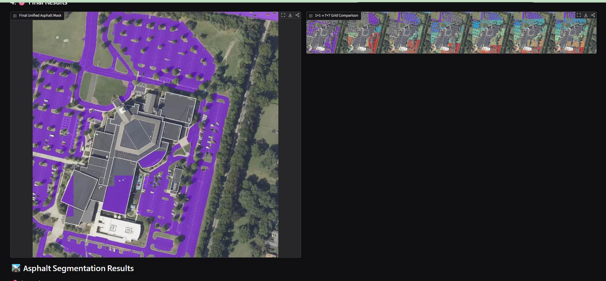

# Paving Measurement

A Gradio application that retrieves a 3x3 Mapbox satellite-image mosaic, uses SAM 3 to segment asphalt pavement, and estimates the covered area. It evaluates multiple grid sizes (1x1 through 7x7) to capture features at different scales.

The reported area is a Web Mercator approximation. It is useful for exploratory analysis and should not be used as a survey-grade measurement.

## Demo



## Project layout

```text
src/paving_measurement/
  app.py            Gradio UI and application entry point
  config.py         validated environment-based settings
  geospatial.py     tile coordinates and area calculations
  image_ops.py      image tiling, overlays, and comparisons
  mapbox.py         Mapbox API client
  segmentation.py   SAM 3 inference and multi-grid pipeline
notebooks/          repeatable experiments
assets/             README images and other lightweight static assets
tests/              focused unit tests
```

## Prerequisites

- Python 3.10 or later
- A Hugging Face account with access to [`facebook/sam3`](https://huggingface.co/facebook/sam3)
- A Mapbox access token with Geocoding and Tiles API access
- An NVIDIA GPU is strongly recommended. CPU inference is supported but can be very slow.

For GPU installation, install the PyTorch build appropriate to your CUDA driver from the [PyTorch selector](https://pytorch.org/get-started/locally/) before installing this project.

## Local installation

Create and activate a virtual environment:

```bash
python -m venv .venv
source .venv/bin/activate
python -m pip install --upgrade pip
pip install -e ".[dev]"
```

Create your local environment file and populate the tokens. Do not commit this file.

```bash
cp .env.example .env
```

Load the variables and start the application:

```bash
set -a
source .env
set +a
python -m paving_measurement.app
```

Open `http://localhost:7860`. On first use, Transformers downloads and caches the SAM 3 weights.

## Configuration

The application reads all configuration from environment variables. `.env` is a convenient local-development file; Docker and hosted deployments should inject secrets through their platform's secret manager.

| Variable | Required | Default | Purpose |
| --- | --- | --- | --- |
| `HF_TOKEN` | Yes | — | Hugging Face token allowed to access SAM 3 |
| `MAPBOX_TOKEN` | Yes | — | Mapbox access token |
| `MODEL_ID` | No | `facebook/sam3` | Hugging Face model ID |
| `SEGMENTATION_PROMPT` | No | `asphalt pavement` | Text prompt used for SAM 3 |
| `BATCH_SIZE` | No | `8` | Images per inference batch; adjust for GPU memory |
| `MIN_ZOOM` / `MAX_ZOOM` | No | `14` / `20` | Permitted Mapbox zoom range |
| `DEFAULT_ZOOM` | No | `18` | Initial UI zoom |
| `HOST` / `PORT` | No | `0.0.0.0` / `7860` | Gradio bind address and port |

## Docker

The included image uses a CUDA-enabled PyTorch base. Install the NVIDIA Container Toolkit on the host, add your tokens to `.env`, then run:

```bash
docker compose up --build
```

Or run it directly:

```bash
docker build -t paving-measurement .
docker run --rm --gpus all --env-file .env -p 7860:7860 paving-measurement
```

For a CPU-only deployment, replace the `Dockerfile` base image with an appropriate CPU PyTorch image and remove `gpus: all` from `docker-compose.yml`. Expect substantially longer inference time.

## Deployment notes

- Inject `HF_TOKEN` and `MAPBOX_TOKEN` using the hosting platform's secrets facility; never bake them into an image or source file.
- Run one application worker per GPU. The model is deliberately initialized once per worker, not per request.
- Mount a persistent Hugging Face cache volume in production to avoid downloading weights after every rollout.
- Set an upstream request timeout suitable for the selected batch size and GPU. A full multi-grid request evaluates 140 image tiles.
- Place the app behind HTTPS and an authentication layer before exposing it publicly. Mapbox tokens should be URL-restricted where possible.
- Pin and regularly review the base image and Python dependencies before a production release.

## Experiments

[`notebooks/experiments.ipynb`](notebooks/experiments.ipynb) is a compact, repeatable notebook for evaluating grid strategies on a local image. It imports the application helpers rather than duplicating pipeline logic. Start Jupyter from the repository root after installation:

```bash
jupyter lab
```

## Quality checks

```bash
pytest
ruff check .
```
