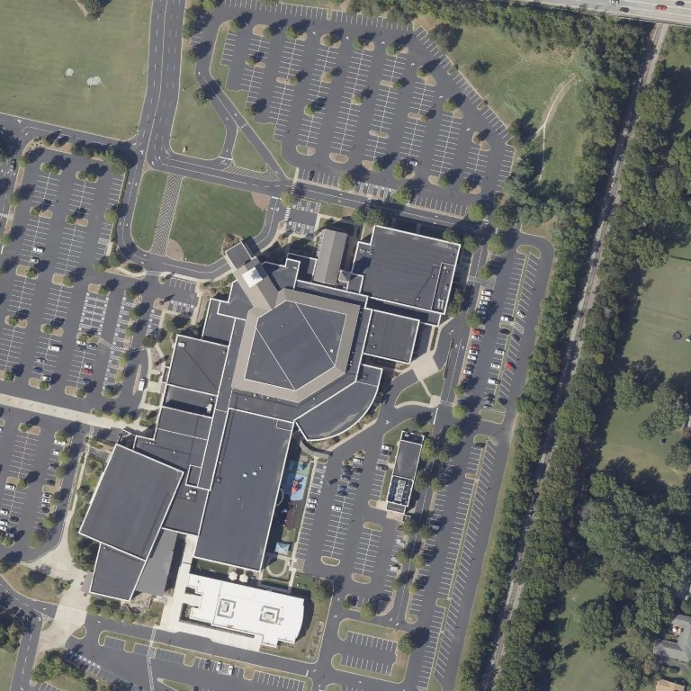
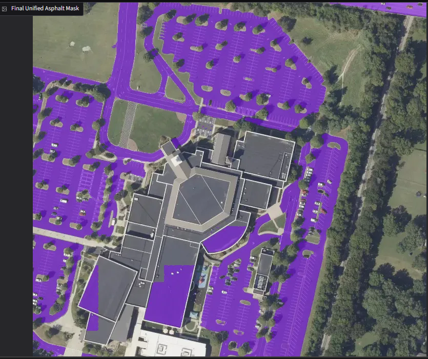
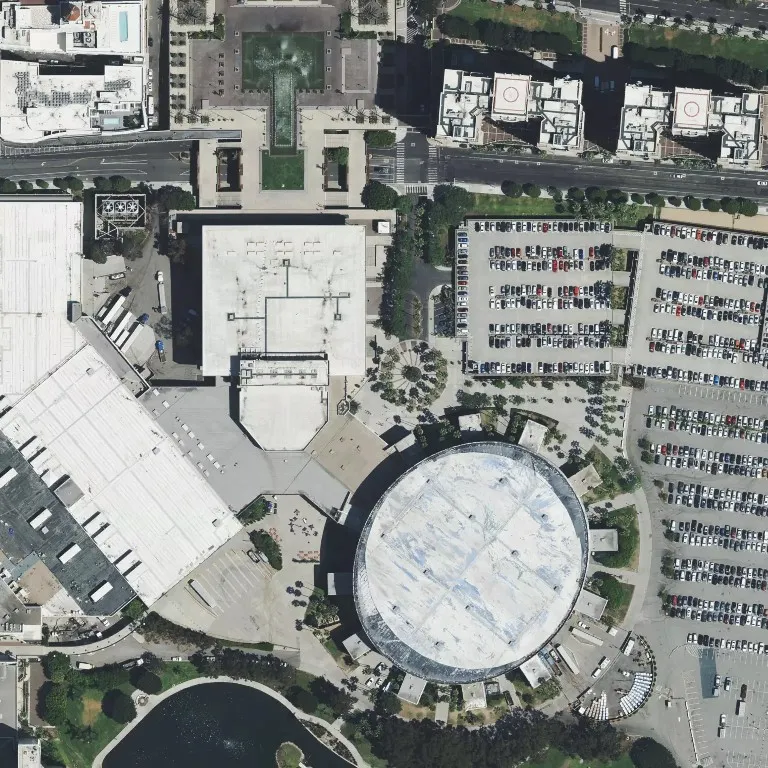
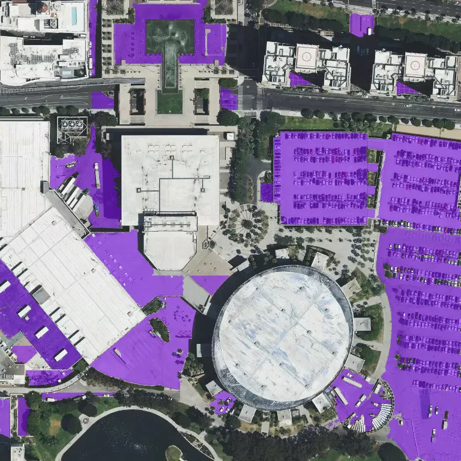

# Paving Measurement

A pavement-analysis service with a local Gradio interface and a FastAPI deployment target. It retrieves a 3x3 Mapbox satellite-image mosaic, uses SAM 3 to segment pavement, and estimates the covered area. It evaluates multiple grid sizes (1x1 through 7x7) to capture features at different scales.

The reported area is a Web Mercator approximation. It is useful for exploratory analysis and should not be used as a survey-grade measurement.

## Demo

### Before segmentation



### After segmentation



### Parking lot prompt

The same workflow can use `parking lot` as the segmentation prompt.

#### Before segmentation



#### After segmentation



## Analysis

The application presents the final unified asphalt mask and a comparison of outputs from each grid size. The grid strategy helps identify pavement at different feature scales.


### Auto-labeling potential

This workflow can also accelerate creation of training data for a future customer-specific pavement model. SAM 3 masks can be exported as candidate labels for satellite images, allowing reviewers to correct only inaccurate boundaries instead of annotating every pavement area from scratch. The reviewed masks can then form a higher-quality, customer-specific dataset for training and evaluating a dedicated model.

Use auto-generated masks as a labeling aid, not as ground truth: retain the source imagery, record reviewer corrections, and define consistent labeling rules before model training.

## Project layout

```text
src/paving_measurement/
  api.py            FastAPI endpoints for programmatic analysis
  app.py            Gradio UI and application entry point
  config.py         validated environment-based settings
  geospatial.py     tile coordinates and area calculations
  image_ops.py      image tiling, overlays, and comparisons
  mapbox.py         Mapbox API client
  segmentation.py   SAM 3 inference and multi-grid pipeline
  satellite.py      Mapbox satellite mosaic service
modal_app.py        Modal GPU deployment definition for FastAPI
notebooks/          repeatable experiments
assets/             README images and other lightweight static assets
tests/              focused unit tests
```

## Prerequisites

- Python 3.10 or later
- A Hugging Face account with access to [`facebook/sam3`](https://huggingface.co/facebook/sam3)
- A Mapbox access token with Geocoding and Tiles API access
- An NVIDIA GPU is strongly recommended. CPU inference is supported but can be very slow.

For GPU installation, install the PyTorch build appropriate to your CUDA driver from the [PyTorch selector](https://pytorch.org/get-started/locally/) before installing this project.

## Local installation

Create and activate a virtual environment:

```bash
python -m venv .venv
source .venv/bin/activate
python -m pip install --upgrade pip
pip install -e ".[dev]"
```

Create your local environment file and populate the tokens. Do not commit this file.

```bash
cp .env.example .env
```

Start the local Gradio application. It automatically loads values from `.env`:

```bash
python -m paving_measurement.app
```

Open `http://localhost:7860`. On first use, Transformers downloads and caches the SAM 3 weights.

## Configuration

The application reads all configuration from environment variables. `.env` is a convenient local-development file; Docker and hosted deployments should inject secrets through their platform's secret manager.

| Variable | Required | Default | Purpose |
| --- | --- | --- | --- |
| `HF_TOKEN` | Yes | — | Hugging Face token allowed to access SAM 3 |
| `MAPBOX_TOKEN` | Yes | — | Mapbox access token |
| `MODEL_ID` | No | `facebook/sam3` | Hugging Face model ID |
| `SEGMENTATION_PROMPT` | No | `asphalt pavement` | Text prompt used for SAM 3 |
| `BATCH_SIZE` | No | `8` | Images per inference batch; adjust for GPU memory |
| `MIN_ZOOM` / `MAX_ZOOM` | No | `14` / `20` | Permitted Mapbox zoom range |
| `DEFAULT_ZOOM` | No | `18` | Initial UI zoom |
| `HOST` / `PORT` | No | `0.0.0.0` / `7860` | Gradio bind address and port |

## Docker

The included image uses a CUDA-enabled PyTorch base. Install the NVIDIA Container Toolkit on the host, add your tokens to `.env`, then run:

```bash
docker compose up --build
```

Or run it directly:

```bash
docker build -t paving-measurement .
docker run --rm --gpus all --env-file .env -p 7860:7860 paving-measurement
```

For a CPU-only deployment, replace the `Dockerfile` base image with an appropriate CPU PyTorch image and remove `gpus: all` from `docker-compose.yml`. Expect substantially longer inference time.

## Modal deployment with FastAPI

`modal_app.py` deploys a FastAPI service instead of the Gradio interface. It uses one NVIDIA A10G GPU, loads SAM 3 once per running container, and persists Hugging Face model files in a Modal Volume to reduce subsequent cold-start downloads. Each `/v1/analyze` request can provide a dynamic comma-separated `prompt`, for example `asphalt pavement, parking lot`.

Install and authenticate the Modal CLI:

```bash
python -m pip install "modal>=1.0"
modal setup
```

Create the Modal secret from your existing local `.env`. The file remains local and is excluded from Git.

```bash
modal secret create paving-measurement-secrets --from-dotenv .env
```

Deploy the API:

```bash
modal deploy modal_app.py
```

The deploy command prints the HTTPS API URL. Use that URL in the following request; FastAPI's interactive OpenAPI documentation is available at `/docs`.

```bash
export MODAL_API_URL="https://your-workspace--paving-measurement-api.modal.run"

curl --location --request POST "$MODAL_API_URL/v1/analyze" \
  --header "Content-Type: application/json" \
  --data '{"address":"1600 Pennsylvania Avenue NW, Washington, DC", "zoom":18}'
```

`POST /v1/satellite` returns the satellite mosaic and coordinates without model inference. `POST /v1/analyze` returns the satellite mosaic, final mask overlay, grid comparison, editable polygon coordinates, ground resolution, measurement summary, and per-grid results. Images are returned as base64 data URLs to keep the API self-contained.

The separate [`frontend/`](frontend/README.md) project provides an address form and browser-side polygon editing. It recalculates square footage as vertices are moved or polygons are removed.

Modal Web Functions have a 150-second request timeout before returning a redirect to the result URL; use `curl --location` or an HTTP client configured to follow redirects for longer segmentation requests. Keep the generated URL behind appropriate authentication or access controls before sharing it publicly.

## Deployment notes

- Inject `HF_TOKEN` and `MAPBOX_TOKEN` using the hosting platform's secrets facility; never bake them into an image or source file.
- Run one application worker per GPU. The model is deliberately initialized once per worker, not per request.
- Mount a persistent Hugging Face cache volume in production to avoid downloading weights after every rollout.
- Set an upstream request timeout suitable for the selected batch size and GPU. A full multi-grid request evaluates 140 image tiles.
- Place the app behind HTTPS and an authentication layer before exposing it publicly. Mapbox tokens should be URL-restricted where possible.
- Pin and regularly review the base image and Python dependencies before a production release.

## Experiments

[`notebooks/experiments.ipynb`](notebooks/experiments.ipynb) is a compact, repeatable notebook for evaluating grid strategies on a local image. It imports the application helpers rather than duplicating pipeline logic. Start Jupyter from the repository root after installation:

```bash
jupyter lab
```

## Quality checks

```bash
pytest
ruff check .
```

## View an API result locally

Save the response from `/v1/analyze` as `result.json`, then run:

```bash
python test.py result.json
```

The script extracts the satellite image, final overlay, and grid comparison into `outputs/` and opens them together. In a headless environment, save them without opening a window:

```bash
python test.py result.json --no-show
```
