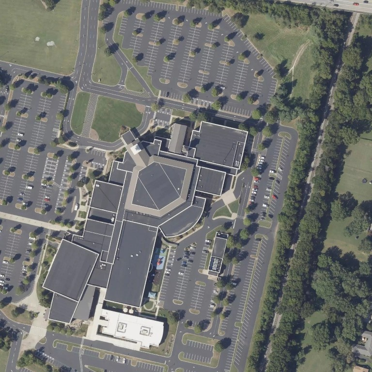
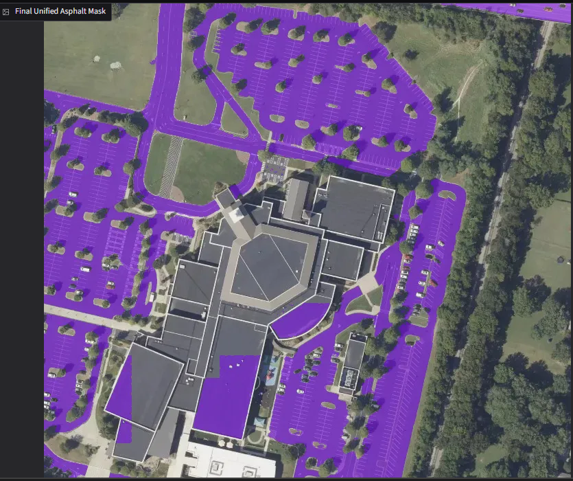
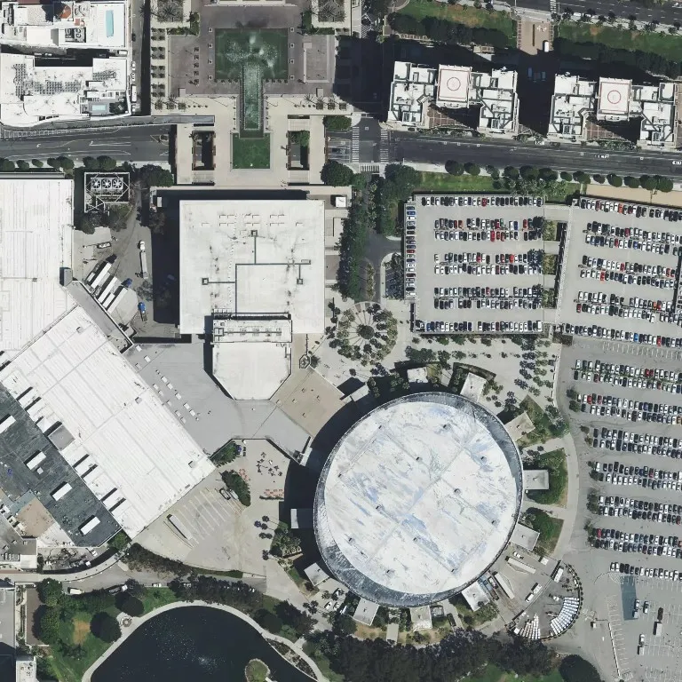
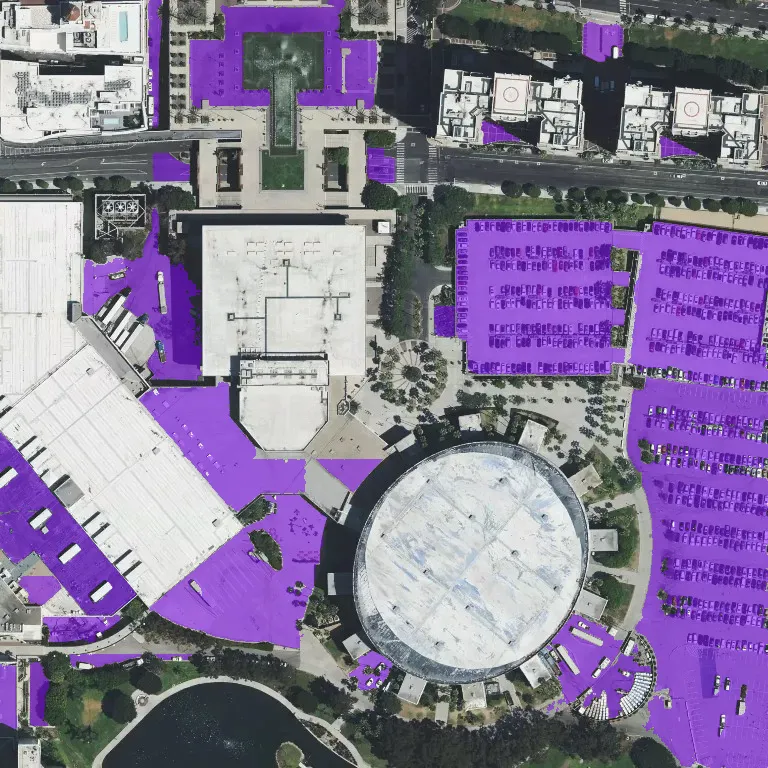
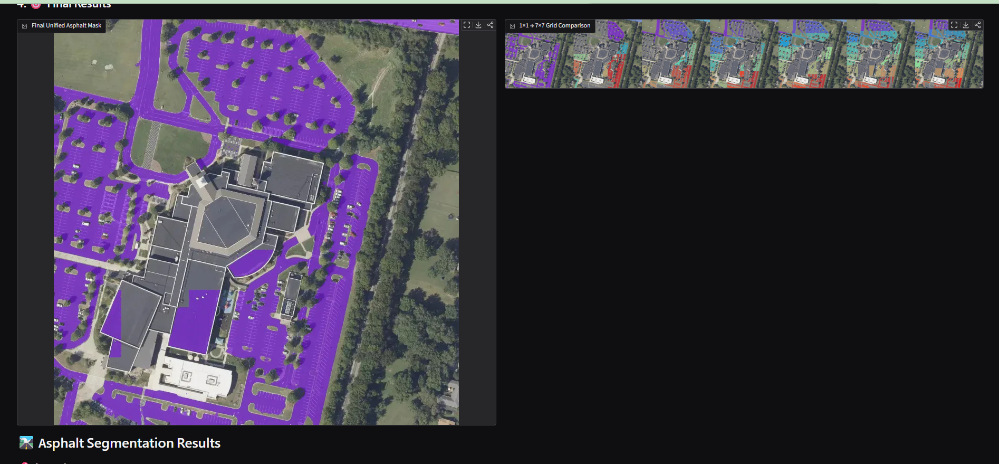

# Paving Measurement

A pavement-analysis service with a local Gradio interface and FastAPI deployment targets. It includes selectable YOLO26 instance/semantic segmentation and an independent YOLO oriented parking-stall API. The map frontend sends geographic polygons in GeoJSON order (`[longitude, latitude]`) to both services.

The reported area is a Web Mercator approximation. It is useful for exploratory analysis and should not be used as a survey-grade measurement.

## Demo

### Before segmentation



### After segmentation



### Parking lot prompt

The same workflow can use `parking lot` as the segmentation prompt.

#### Before segmentation



#### After segmentation



## Analysis

The application presents the final unified asphalt mask and a comparison of outputs from each grid size. The grid strategy helps identify pavement at different feature scales.



### Auto-labeling potential

This workflow can also accelerate creation of training data for a future customer-specific pavement model. SAM 3 masks can be exported as candidate labels for satellite images, allowing reviewers to correct only inaccurate boundaries instead of annotating every pavement area from scratch. The reviewed masks can then form a higher-quality, customer-specific dataset for training and evaluating a dedicated model.

Use auto-generated masks as a labeling aid, not as ground truth: retain the source imagery, record reviewer corrections, and define consistent labeling rules before model training.

## Project layout

```text
src/paving_measurement/
  api.py            FastAPI endpoints for programmatic analysis
  app.py            Gradio UI and application entry point
  config.py         validated environment-based settings
  geospatial.py     tile coordinates and area calculations
  image_ops.py      image tiling, overlays, and comparisons
  mapbox.py         Mapbox API client
  segmentation.py   SAM 3 inference and multi-grid pipeline
  parking_api.py     FastAPI parking-stall endpoint
  parking_detection.py tile windows, coordinate projection, and deduplication
  satellite.py      Mapbox satellite mosaic service
modal_app.py        Modal GPU deployment definition for FastAPI
parking_modal_app.py Modal GPU deployment for tiled parking-stall detection
notebooks/          repeatable experiments
assets/             README images and other lightweight static assets
tests/              focused unit tests
```

## Prerequisites

- Python 3.10 or later
- A Hugging Face account with access to `otmanheddouch/yolo26n-seg`
- A Mapbox access token with Geocoding and Tiles API access
- An NVIDIA GPU is strongly recommended. CPU inference is supported but can be very slow.

For GPU installation, install the PyTorch build appropriate to your CUDA driver from the [PyTorch selector](https://pytorch.org/get-started/locally/) before installing this project.

## Local installation

Create and activate a virtual environment:

```bash
python -m venv .venv
source .venv/bin/activate
python -m pip install --upgrade pip
pip install -e ".[dev]"
```

Create your local environment file and populate the tokens. Do not commit this file.

```bash
cp .env.example .env
```

Start the local Gradio application. It automatically loads values from `.env`:

```bash
python -m paving_measurement.app
```

Open `http://localhost:7860`. On first use, Transformers downloads and caches the SAM 3 weights.

## Configuration

The application reads all configuration from environment variables. `.env` is a convenient local-development file; Docker and hosted deployments should inject secrets through their platform's secret manager.

| Variable | Required | Default | Purpose |
| --- | --- | --- | --- |
| `HF_TOKEN` | Yes | — | Hugging Face token allowed to access SAM 3 |
| `MAPBOX_TOKEN` | Yes | — | Mapbox access token (geocoding and selectable imagery fallback) |
| `GOOGLE_MAPS_API_KEY` | No | — | Server-side Google Map Tiles API key; used when `SATELLITE_PROVIDER=google` or a request selects Google imagery |
| `SATELLITE_PROVIDER` | No | `mapbox` | Default backend imagery provider: `mapbox` or `google` |
| `MODEL_ID` | No | `otmanheddouch/yolo26n-seg` | Hugging Face YOLO segmentation model ID |
| `SEGMENTATION_PROMPT` | No | `asphalt pavement` | Text prompt used for SAM 3 |
| `BATCH_SIZE` | No | `8` | Images per inference batch; adjust for GPU memory |
| `MIN_ZOOM` / `MAX_ZOOM` | No | `14` / `20` | Permitted Mapbox zoom range |
| `DEFAULT_ZOOM` | No | `18` | Initial UI zoom |
| `HOST` / `PORT` | No | `0.0.0.0` / `7860` | Gradio bind address and port |

## Docker

The included image uses a CUDA-enabled PyTorch base. Install the NVIDIA Container Toolkit on the host, add your tokens to `.env`, then run:

```bash
docker compose up --build
```

Or run it directly:

```bash
docker build -t paving-measurement .
docker run --rm --gpus all --env-file .env -p 7860:7860 paving-measurement
```

For a CPU-only deployment, replace the `Dockerfile` base image with an appropriate CPU PyTorch image and remove `gpus: all` from `docker-compose.yml`. Expect substantially longer inference time.

## Modal deployment with FastAPI

`modal_app.py` deploys a FastAPI service instead of the Gradio interface. It uses a T4 GPU, loads both `best.pt` (instance masks) and `sem-yolo.pt` (semantic parking-area masks) once per running container, and persists Hugging Face model files in a Modal Volume to reduce subsequent cold-start downloads. The legacy `prompt` field is accepted for request compatibility.

Install and authenticate the Modal CLI:

```bash
python -m pip install "modal>=1.0"
modal setup
```

Create the Modal secret from your existing local `.env`. The file remains local and is excluded from Git.

```bash
modal secret create paving-measurement-secrets --from-dotenv .env
```

Deploy the API:

```bash
modal deploy modal_app.py
```

The deploy command prints the HTTPS API URL. Use that URL in the following request; FastAPI's interactive OpenAPI documentation is available at `/docs`.

```bash
export MODAL_API_URL="https://your-workspace--paving-measurement-api.modal.run"

curl --location --request POST "$MODAL_API_URL/v1/analyze" \
  --header "Content-Type: application/json" \
  --data '{"address":"1600 Pennsylvania Avenue NW, Washington, DC", "zoom":18}'
```

`POST /v1/satellite` returns the satellite mosaic and coordinates without model inference. `POST /v1/analyze` returns the satellite mosaic, final mask overlay, grid comparison, editable polygon coordinates, ground resolution, measurement summary, and per-grid results. Images are returned as base64 data URLs to keep the API self-contained.

`POST /v1/analyze-polygon` accepts a user-drawn GeoJSON-order polygon ring (`[longitude, latitude]`) instead of an address. It retrieves tiles from the selected Mapbox or Google provider, runs fixed inference zoom 20, and returns geographic mask contours. Set `segmentation_mode` to `instance` (default) or `semantic`; semantic mode uses `sem-yolo.pt` and returns parking-area masks. The default `processing_mode: "whole"` stitches the complete selected tile rectangle into one image. The map's visual zoom is not used for model quality.

The frontend erase brush is deliberately browser-only. It subtracts brush strokes from the returned mask geometry and recalculates the displayed area locally; brush coordinates are not sent back to the model API. This allows human correction without rerunning inference.

The separate [`frontend/`](frontend/README.md) project provides address navigation, a full-screen MapLibre satellite map, polygon drawing/editing, layer visibility controls, YOLO mask editing, oriented stall boxes, and real-world quantity summaries.

## YOLO segmentation polygon analysis

The map workflow uses `POST /v1/analyze-polygon`:

```json
{
  "polygons": [[[-77.0366, 38.8975], [-77.0359, 38.8975], [-77.0359, 38.8971]]],
  "prompt": "asphalt pavement, parking lot"
}
```

The service validates the ring and uses fixed inference zoom 20 regardless of the map's visual zoom. In whole mode it stitches the complete inclusive provider tile rectangle into one image. Instance mode uses `best.pt`; semantic mode uses `sem-yolo.pt` and treats the returned raster masks as parking-area coverage. Ultralytics mask coordinates are scaled to the actual mosaic, clipped to the input polygon, and projected back to `[longitude, latitude]` using the tile origin and fixed zoom.

Only contours with points inside the submitted polygon are returned. `area_m2` and `area_ft2` are calculated from those returned geographic contours, so the number represents detected objects inside the input region rather than the entire downloaded imagery. The frontend uses `polygons` for purple editable overlays and calculates the separate input-region area in the browser. `tile_count` is the total source-tile count and `chunk_count` reports the number of whole-image YOLO passes.

Response shape:

```json
{
  "tile_count": 4,
  "chunk_count": 1,
  "processing_mode": "whole",
  "segmentation_mode": "instance",
  "polygon_geometries": [[[[ -77.0364, 38.8974 ]]]],
  "polygons": [[[-77.0364, 38.8974], [-77.0362, 38.8974], [-77.0362, 38.8972]]],
  "meters_per_pixel": 0.11,
  "area_m2": 128.4,
  "area_ft2": 1381.9,
  "grid_results": [],
  "summary": "..."
}
```

The older `POST /v1/analyze` route accepts an address or centre coordinate and runs one whole-image YOLO segmentation pass, returning base64 raster images and pixel contours. The map frontend uses `/v1/analyze-polygon` because it needs geographic contours rather than an image-only result.

## Parking-stall detection on Modal

### Service data flow

```text
Frontend polygon: [[longitude, latitude], ...]
        |
        +--> provider tile bounds at fixed inference zoom 20
        |
        +--> download every 256x256 satellite tile in the bounds
        |
        +--> overlapping 2x2 windows, one inference at a time
        |
        +--> upscale window to 1280px, run YOLO checkpoint
        |
        +--> oriented box corners + centre -> tile pixels -> geographic coordinates
        |
        +--> polygon filter -> 2.5-metre centre deduplication
        |
        `--> spots[] returned to frontend as yellow map points
```

The important distinction is that the API does not send one large satellite image to YOLO in tiled mode. It downloads the complete source-tile rectangle, then scans that rectangle through overlapping windows. A 2x2 window is 512x512 source pixels. It is enlarged before inference so a stall does not become too small just because the selected property is large. Neighboring windows share one tile, which gives detections near a window edge a second chance. Repeated detections are merged by geographic centre distance. The frontend renders only `spots[].coordinates` as dots; OBB corners remain in the API response for downstream consumers but are not drawn by the current UI.

`parking_modal_app.py` is a separate serverless GPU deployment for the Hugging Face oriented-object-detection model `otmanheddouch/yolov8n-obb-09-25-2026`. It receives the user-drawn areas as GeoJSON-order polygon rings (`[longitude, latitude]`), downloads every source tile covering those rings at fixed inference zoom 20, and processes overlapping 2-by-2 tile windows one at a time. Each window is upscaled to the requested inference size (1280px by default), then each OBB's centre and four rotated corners are converted back to geographic coordinates. This preserves stall orientation and detail for large areas and reduces misses at tile borders. Only detections whose centres lie inside a submitted polygon are returned. Overlap duplicates are removed by keeping the highest-confidence centre within two metres. The API also supports `processing_mode: "whole"` as a comparison mode: it downloads the complete tile mosaic and runs one OBB inference over that image.

It uses the existing `paving-measurement-secrets` secret for `HF_TOKEN` and `MAPBOX_TOKEN`, plus the optional `paving-measurement-google` secret for `GOOGLE_MAPS_API_KEY`. Set `SATELLITE_PROVIDER=google` to make Google the backend default, or send `imagery_provider: "google"` on an individual analysis request; Mapbox remains available with `SATELLITE_PROVIDER=mapbox` or `imagery_provider: "mapbox"`. Deploy it independently:

```bash
modal deploy parking_modal_app.py
```

Then call its `POST /v1/detect-parking-stalls` endpoint. The response's `spots[].coordinates` is directly usable as a map marker position; each spot also includes `corners`, an ordered four-point oriented polygon in `[longitude, latitude]` order, plus `angle_degrees` and `class_id`.

```bash
export PARKING_API_URL="https://your-workspace--parking-stall-detection-api.modal.run"

curl --location --request POST "$PARKING_API_URL/v1/detect-parking-stalls" \
  --header "Content-Type: application/json" \
  --data '{
    "processing_mode": "tiled",
    "polygons": [[
      [-77.0366, 38.8975],
      [-77.0359, 38.8975],
      [-77.0359, 38.8971],
      [-77.0366, 38.8971]
    ]]
  }'
```

The default request limit is 400 source tiles at fixed inference zoom 20. `tiles_per_chunk` defaults to nine and controls the maximum source tiles in each whole-image SAM pass. For an even larger site, split the drawn region into multiple polygons or increase `max_tiles` within the serverless resource budget. `max_tiles` and `tiles_per_chunk` are optional request controls documented in `/docs`; a legacy `zoom` field is accepted for compatibility but ignored.

### Parking request and response contract

Request fields:

| Field | Default | Meaning |
| --- | ---: | --- |
| `polygons` | required | Rings of `[longitude, latitude]` positions |
| `processing_mode` | `tiled` | `tiled` for overlapping windows or `whole` for one downloaded mosaic |
| `zoom` | ignored | Deprecated; server always uses inference zoom 20 |
| `confidence` | `0.25` | YOLO confidence threshold |
| `max_tiles` | `400` | Maximum source tiles downloaded for one request |
| `imgsz` | `1280` | Inference image size after window upscaling |
| `duplicate_distance_meters` | `2.5` | Radius used to merge nearby detections |

Response fields:

| Field | Meaning |
| --- | --- |
| `tile_count` | Number of source Mapbox tiles downloaded |
| `spots[].coordinates` | `[longitude, latitude]` centre for a detected stall |
| `spots[].corners` | Four geographic corners of the oriented stall box |
| `spots[].angle_degrees` | OBB rotation angle from the model |
| `spots[].class_id` | Detected class index |
| `spots[].confidence` | YOLO confidence score |
| `spots[].polygon_index` | Submitted polygon containing the centre |

Modal Web Functions have a 150-second request timeout before returning a redirect to the result URL; use `curl --location` or an HTTP client configured to follow redirects for longer segmentation requests. Keep the generated URL behind appropriate authentication or access controls before sharing it publicly.

## Data contract between frontend and services

The frontend stores the user input as one or more rings:

```text
Polygon = [[longitude, latitude], [longitude, latitude], ...]
```

It sends the same ring to both models:

```text
Frontend -> SAM3:     { polygons: [inputPolygon], prompt }
Frontend -> Parking:  { polygons: [inputPolygon] }
```

SAM3 returns `polygons[]`, where each item is a detected geographic object contour. Parking returns `spots[]`, where each item contains a centre `coordinates` pair. The browser passes those coordinates directly to MapLibre GeoJSON sources; it does not convert them to screen pixels. Pixel conversion exists only inside the backend while matching model outputs to satellite tiles.

The frontend maintains independent layers for cyan input areas, purple YOLO masks, red correction regions, and yellow parking-stall centre points. Each can be hidden without deleting data. Input vertices and mask contours can be edited, and the erase brush subtracts from the displayed mask and sidebar area locally.

## Deployment notes

## Current behavior and known limitations

- Model inference always uses fixed zoom 20. The browser zoom changes only map presentation.
- The rectangular debug image can include imagery outside the user polygon because source tiles are rectangular; masks and backend area calculations are clipped to the selected polygon.
- A cold Modal request can take substantially longer than local inference because it may start a GPU container, load two Hugging Face checkpoints, create a Google tile session, download source tiles, stitch the mosaic, and run YOLO. Whole-image mode is especially expensive for large polygons.
- The semantic checkpoint is expected to expose YOLO `results.masks.data`; if it returns a different tensor layout, the API may report zero masks and the checkpoint output should be inspected before changing the frontend.
- Browser erase-brush corrections are local refinements. They persist in project `localStorage`, update the displayed mask area, and are not sent back to the model for retraining or re-inference.
- The reported area is an approximate geographic/Web Mercator calculation, not survey-grade measurement.

- Inject `HF_TOKEN`, `MAPBOX_TOKEN`, and (when using Google) `GOOGLE_MAPS_API_KEY` using the hosting platform's secrets facility; never bake them into an image or source file.
- Run one application worker per GPU. The model is deliberately initialized once per worker, not per request.
- Mount a persistent Hugging Face cache volume in production to avoid downloading weights after every rollout.
- Set an upstream request timeout suitable for the selected batch size and GPU. A full multi-grid request evaluates 140 image tiles.
- Place the app behind HTTPS and an authentication layer before exposing it publicly. Mapbox tokens should be URL-restricted where possible.
- Pin and regularly review the base image and Python dependencies before a production release.

## Experiments

[`notebooks/experiments.ipynb`](notebooks/experiments.ipynb) is a compact, repeatable notebook for evaluating grid strategies on a local image. It imports the application helpers rather than duplicating pipeline logic. Start Jupyter from the repository root after installation:

```bash
jupyter lab
```

## Quality checks

```bash
pytest
ruff check .
```

## View an API result locally

Save the response from `/v1/analyze` as `result.json`, then run:

```bash
python test.py result.json
```

The script extracts the satellite image, final overlay, and grid comparison into `outputs/` and opens them together. In a headless environment, save them without opening a window:

```bash
python test.py result.json --no-show
```
